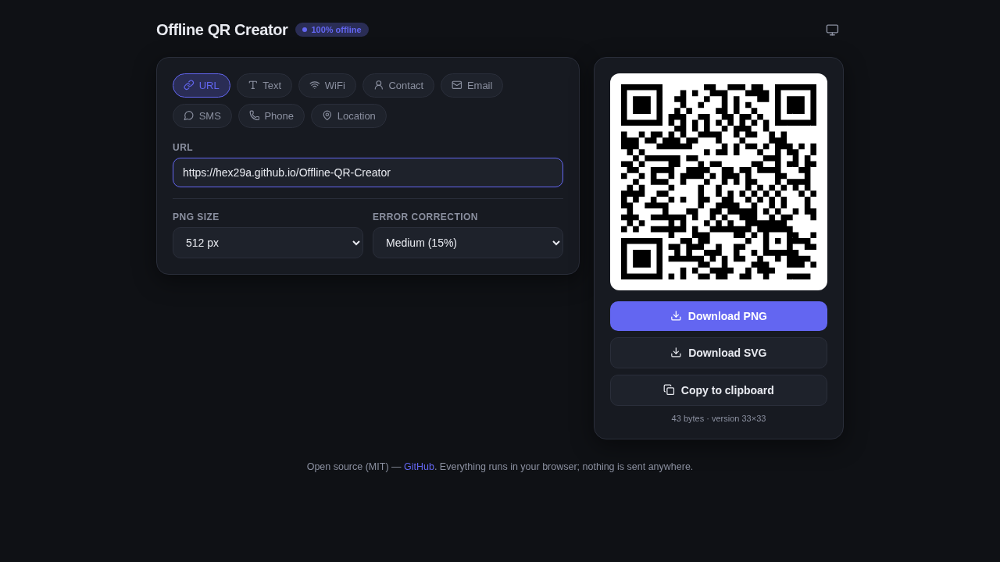

# Offline QR Creator 💾

A fast, modern, **truly offline** QR code generator. One self-contained HTML file — the QR library is embedded, no CDN, no network requests, nothing leaves your browser.

[**▶️ Open the app**](https://hex29a.github.io/Offline-QR-Creator)

---

## Features ✨

* **8 formats**: URL, plain text, WiFi credentials, contact (vCard), email, SMS, phone, geo-location
* **Live generation** — the QR code updates as you type, no button to press
* **Truly offline** — the QR library ([qrcode-generator](https://github.com/kazuhikoarase/qrcode-generator), MIT) is embedded in the page; zero external requests
* **Installable PWA** — add it to your home screen and it works with no connection at all
* **Export**: download as **PNG** (256/512/1024 px) or **SVG**, or copy straight to the clipboard
* **Error correction** selectable (L/M/Q/H)
* **UTF-8 safe** — åäö, emoji and any Unicode text encode correctly
* **WiFi escaping** per spec — SSIDs and passwords with `; , : " \` work
* **Dark/light theme** — follows your system, with a manual toggle (auto → dark → light)

## How to use 🚀

1. Open the [live app](https://hex29a.github.io/Offline-QR-Creator) — or download `index.html` and open it locally, it works identically.
2. Pick a format chip, fill in the fields. The QR code renders live.
3. Download as PNG/SVG or copy to the clipboard.

## Tech 🛠️

* Single `index.html` — vanilla HTML/CSS/JS, no frameworks, no build step
* [qrcode-generator](https://github.com/kazuhikoarase/qrcode-generator) (MIT) embedded inline, UTF-8 mode enabled
* [Lucide](https://lucide.dev) icons (ISC) as inline SVG
* `manifest.json` + service worker for installable, offline-capable PWA

## License

MIT — see [LICENSE](LICENSE).
